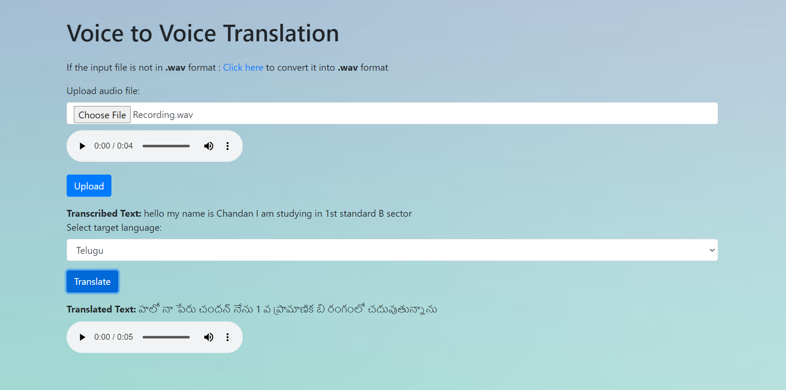

# Multimodal Language Translator

## Description
Multimodal language translator allows users to translate text, speech, and images into different languages. Utilizing tools such as Google Translate, Google Text-to-Speech (gTTS), and Optical Character Recognition (OCR), it provides a seamless experience for users to input various forms of data and receive translations. The application supports multiple languages and offers a user-friendly interface for both text and audio translations, as well as text extraction from images.

## Features
- **Text to Text Translation**: Input text and translate it into another language.
- **Voice to Voice Translation**: Upload an audio file, transcribe it to text, and translate it.
- **Image to Text Translation**: Upload an image, extract text, and translate it.

## Results

<table>
    <tr>
        <td></td>
        <td></td>
    </tr>
    <tr>
        <td></td>
        <td></td>
    </tr>
    <tr>
        <td></td>
        <td></td>
    </tr>
</table>


## Requirements
- Python 3.x
- Flask
- Googletrans
- gTTS
- SpeechRecognition
- Pytesseract
- Pydub
- Pillow (PIL)

## How to Run
1. Clone the repository.
   ```bash
   git clone https://github.com/Arshad-khan05/MiniProject.git
   ```
3. Install the required dependencies.
    ```bash
    pip install -r requirements.txt
    ```
4. Run the Flask app:

    ```bash
    python app.py

    ```
5. Open your browser and go to:

    ```
    http://127.0.0.1:5000
    ```

## How to Use
- **Text to Text**: Enter text, choose the language, and translate.
- **Voice to Voice**: Upload an audio file, transcribe, and translate.
- **Image to Text**: Upload an image, extract text, and translate.

